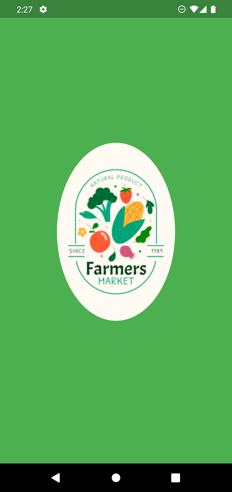
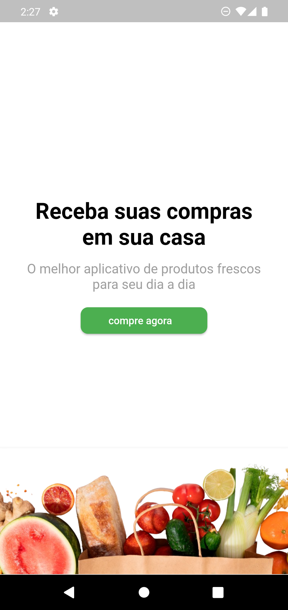
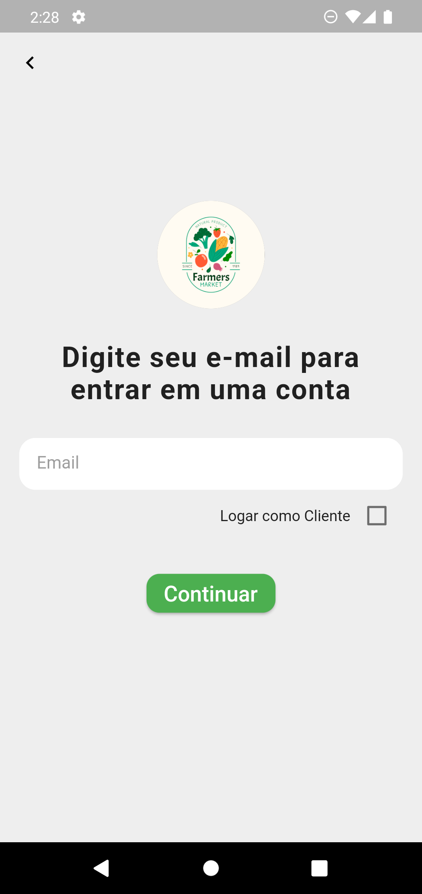
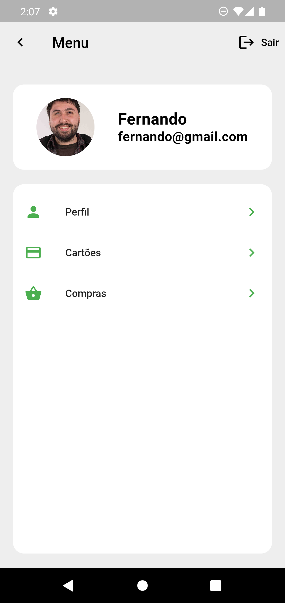
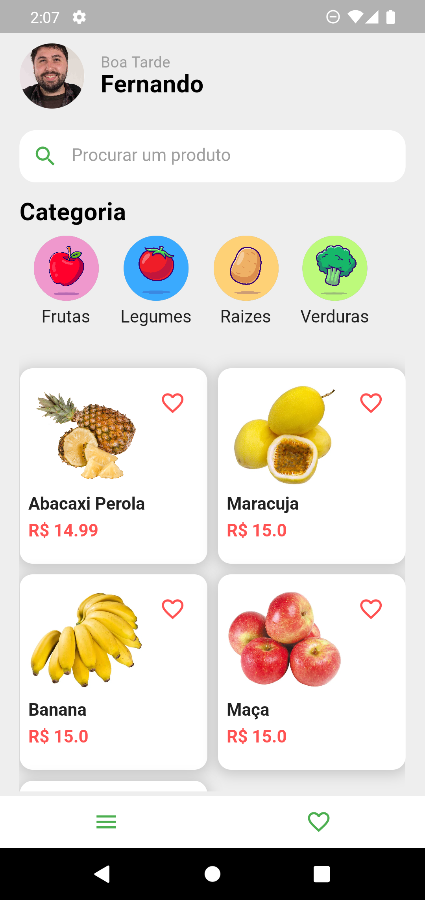
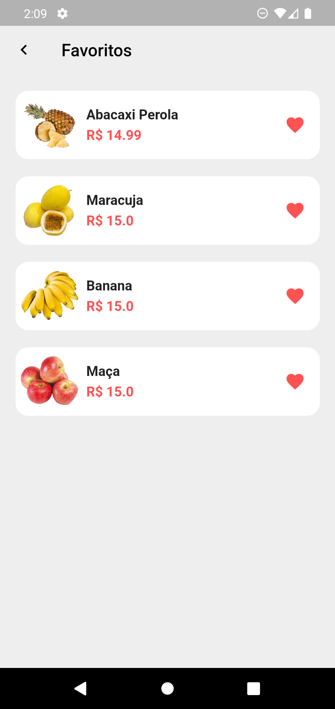
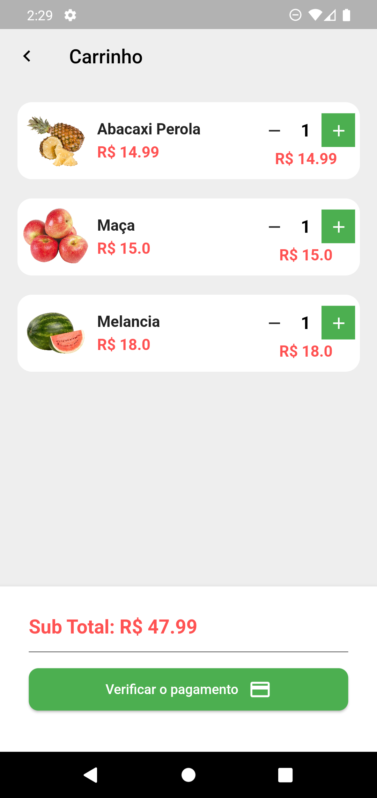
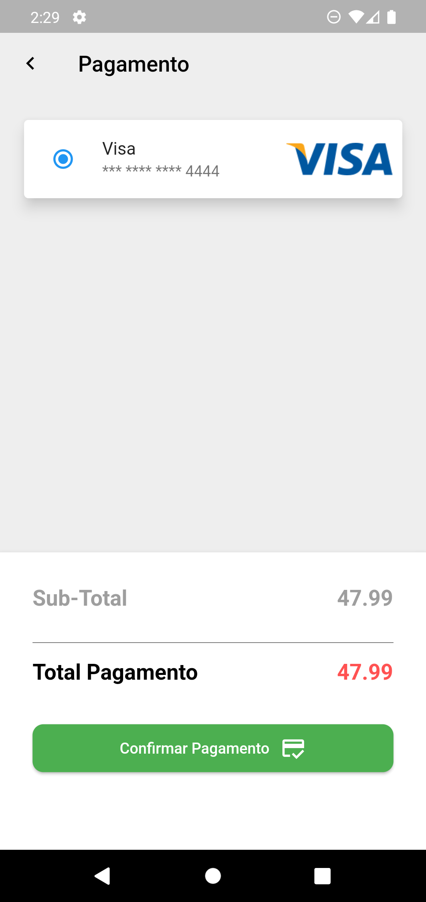
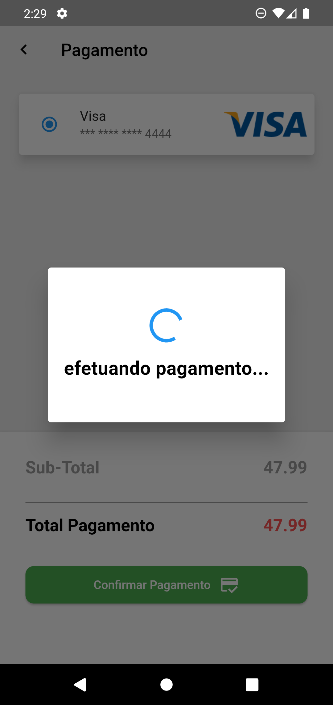

# HortiFruit
Após dedicar tempo e esforço ao estudo do Flutter, estou compartilhando meu primeiro app o qual facilita a conexão com produtos frescos, diretamente do campo para a sua mesa. 🍏🍅

## Principais Recursos
- ✅ Navegação intuitiva e amigável.
- ✅ Catálogo completo de produtos frescos.
- ✅ Listas de Produtos Favoritos
- ✅ Forma de pagamento rápida e segura.

## Desenvolvimento
No entanto, é crucial ressaltar a importância do meu estudo, especialmente no que diz respeito à escolha de um banco de dados NoSQL. Optei pela poderosa ferramenta Firebase e descobri a sua abrangência e eficácia. Enfrentei um desafio significativo ao lidar com a repetição de dados, uma consideração crucial neste projeto.

A decisão estratégica de explorar um banco de dados não relacional, como o Firebase, revelou-se acertada. A repetição de dados pode representar um obstáculo substancial, e minha experiência destacou maneiras eficazes de abordar esse desafio. Essa escolha contribuiu significativamente para a robustez e eficiência do HortiFruit.

Ao equilibrar habilmente a estrutura de dados denormalizada com otimizações para leituras e escritas, foi possível maximizar as vantagens do Firebase, tornando o projeto HortiFruit sólido e eficiente. Essa abordagem reflete não apenas a compreensão da complexidade do desafio, mas também a habilidade de implementar soluções práticas para garantir o sucesso do projeto.

## Fotos

 
 

 
 
 
 

## Observações
As imagens utilizadas neste app são apenas para fins de demonstração. Elas foram incluídas com o único propósito de ilustrar visualmente como o aplicativo poderá se parecer quando estiver completo. 